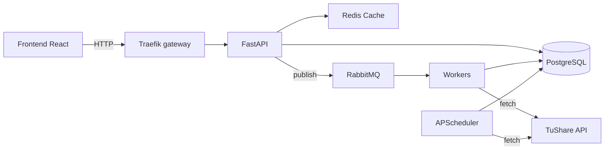
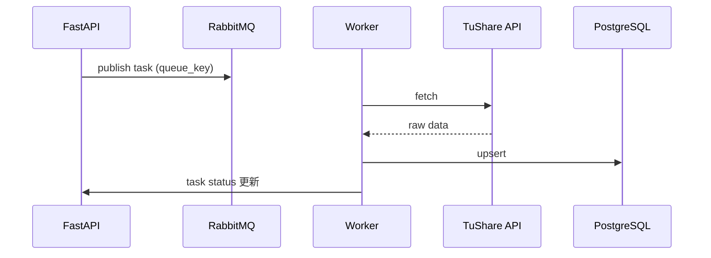

# 后端架构

> 当前态文档。历史演进见 [`../../evolution.md`](../../evolution.md)，决策理由见 [`../../decisions/index.md`](../../decisions/index.md)。
>
> 原文件名 `ARCHITERTURE.md`（拼写错误）已修正为本文件。

## 1. 系统概览

stock-bot 后端是 A 股市场数据的采集、存储与查询分析服务：FastAPI 异步应用 + PostgreSQL（存储）+ Redis（缓存）+ RabbitMQ（异步任务）+ APScheduler（定时采集）。



## 2. 分层与依赖方向（不变量）

```
app/api/v1/  →  app/services/  →  app/repositories/  →  app/models/
     ↓               ↓                    ↓
 app/schemas    app/core             app/config
```

| 层 | 职责 | 允许依赖 |
|---|---|---|
| `app/api/v1` | 路由、请求校验、响应 schema | `services`、`schemas`、`core`（**不直接 import `repositories`/`models`**） |
| `app/services` | 业务编排（缓存 / DB / 队列） | `repositories`、`models`、`core`、`schemas` |
| `app/repositories` | 数据访问（SQLAlchemy async） | `models`、`core` |
| `app/models` | ORM 表定义 | `core` |
| `app/core` | 基建（`mq.py`、`cache.py`、`security`…） | 无上层依赖 |
| `app/workers` · `app/scheduler` | 任务执行入口 | **只调 `services`**（与手动入口共用同一 ingest 方法，禁止平行实现抓取逻辑） |

> 上表是**约定**；机械校验（结构测试/`import-linter` 类检查）属于工程环境计划，尚未落地。新增代码请遵守，评审时按此表检查。

## 3. 数据流



读路径是标准 read-through：命中 Redis 直接返回；未命中查库并回填。**Redis 不可用会静默降级为 cache miss**（不报错）——本地/性能类排查务必先确认 `REDIS_URL` 指对（本机映射 6380）。

## 4. 采集双轨制

| 轨 | 载体 | 用途 |
|---|---|---|
| 自动 | APScheduler（`app/scheduler/runner.py` 的 `create_scheduler()` → `jobs.py`） | 每日增量、盘中轮询、按 cadence 的对账式自愈 |
| 手动 | RabbitMQ Worker（`app/workers/`） | 任意时间手动回补、批量重拉、一次性修复 |

**两条轨必须共用同一个 service ingest 方法**；新增队列在 `app/core/mq.py` 的 `QUEUES` 注册，映射规则 `queue_name = "stock_bot." + queue_key`。

### 队列注册表（`app/core/mq.py`）

| Queue key | RabbitMQ queue |
|---|---|
| `universe.fetch` | `stock_bot.universe.fetch` |
| `quotes.fetch` | `stock_bot.quotes.fetch` |
| `daily_basic.fetch` | `stock_bot.daily_basic.fetch` |
| `financial.fetch` | `stock_bot.financial.fetch` |
| `features.compute` | `stock_bot.features.compute` |
| `clustering.run` | `stock_bot.clustering.run` |
| `llm.explain` | `stock_bot.llm.explain` |
| `industry_metrics.fetch` | `stock_bot.industry_metrics.fetch` |
| `securities.fetch` | `stock_bot.securities.fetch` |
| `market_data.fetch` | `stock_bot.market_data.fetch` |

漏注册的后果：`BaseWorker.run()` 因 KeyError 启动失败。

## 5. API 结构（`app/api/v1/__init__.py` 装配）

| 前缀 | 路由模块 | 内容 |
|---|---|---|
| `/api/v1/exchanges` | `stocks.py` | 交易所名录、分类、股票列表、enriched 列表；**个股层面全部挂在 `/exchanges/{exchange}/stocks/{symbol}/...` 下**：`quotes/daily`·`quotes/latest`（`quotes.py`）、`features`·`features/radar`（`features.py`）、`financial-summary`·`financial-statements`·`valuation-history`（`financials.py`） |
| `/api/v1/market` | `market.py` | 指数、涨跌分布、榜单、板块、资金流、热门板块、申万行业树与表现、SSE 指数快照 |
| `/api/v1/market` | `market_data.py` | 全球指数、板块资金流、北向、龙虎榜、大宗、解禁、回购、公告、涨停梯队、情绪日历/盘中、数据新鲜度 |
| `/api/v1/clusters` | `clusters.py` | 聚类运行、分布、成员、解释 |
| `/api/v1/industries` | `industries.py` | 投研工作台：看板、指标最新/历史、公司、证券、知识库 |
| `/api/v1/concepts` | `concepts.py` | 概念板块列表/详情/成分 |
| `/api/v1/new-stocks` | `new_stocks.py` | 次新股 |
| `/api/v1/tags` | `tags.py` | 自定义标签与分组 |
| `/api/v1/watchlists` | `watchlists.py` | 自选股 |
| `/api/v1/tasks` | `tasks.py` | 异步任务状态与手动触发 |

> `/market` 前缀由两个模块共用（`market.py` 与 `market_data.py`），改动时注意两端点的命名不要撞车。

数据新鲜度的权威入口是 `GET /api/v1/market/data-freshness`（见 [`../deployment/operations.md`](../../deployment/operations.md)）。

## 6. 数据模型要点

| 领域 | 关键表 |
|---|---|
| 名录 | `stocks`（`ts_code → stock_id` 映射的**源表**，被多个采集域当作映射表使用，冻结即静默丢数） |
| 行情 | `daily_quotes`（日线，按 `trade_date` 分区查询）、`daily_basic_indicators`、`stock_price_limits` |
| 分类 | `sw_industry_classes` / `sw_industry_members`（申万）、概念板块与成分表（业务键为 `symbol`，见 [ADR 0003](../../decisions/0003-concept-membership-symbol-as-key.md)） |
| 投研 | `industry_metrics`（行业级 `stock_id` 为 NULL、公司级带 `stock_id`，单表共用一个读取面）、`industry_reference_points`、`industry_signals` |
| 任务 | `tasks`（任务状态跟踪） |
| 派生 | 由基础表计算并按 upsert 写回的指标行 |

更完整的库表与约束见 [`database-architecture.md`](../database-architecture.md)。

## 7. 时间与时区（易错）

- 容器默认 UTC。**业务时间判断必须显式 `ZoneInfo("Asia/Shanghai")`**，且与 `CronTrigger` 使用同一时区；job 内用 naive `datetime.now()` 会永远为 False，任务全部静默跳过
- "上一交易日"必须查 `trade_cal` 表，不能用 `weekday()` 推算
- 写入窗口的上界是**上一个已完成交易日**，不是 `date.today()`（否则写入半截行情，`max(trade_date)` 被顶到今天后全站退化）

## 8. 技术栈

| 组件 | 技术 |
|---|---|
| Web | FastAPI（async） |
| DB / ORM | PostgreSQL 15 + SQLAlchemy 2.0 async + Alembic |
| 缓存 | Redis 7（默认 TTL 300s，键必须含 `as_of` 等数据判据维度） |
| 队列 | RabbitMQ 4.2（`aio_pika`，robust connection） |
| 调度 | APScheduler（`CronTrigger`，`Asia/Shanghai`） |
| 数据源 | TuShare Pro（主源，见 [ADR 0001](../../decisions/0001-single-primary-source-tushare.md)）、东财/同花顺/巨潮（板块与公告类） |
| 依赖与检查 | uv；ruff（line-length 100）+ mypy（pydantic plugin） |
| 部署 | Docker Compose（见 [`../deployment/`](../../deployment/)） |
