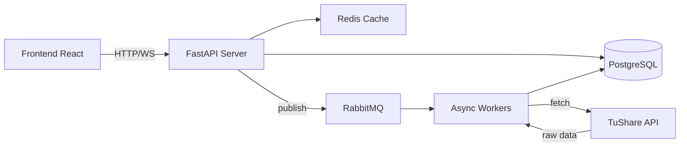
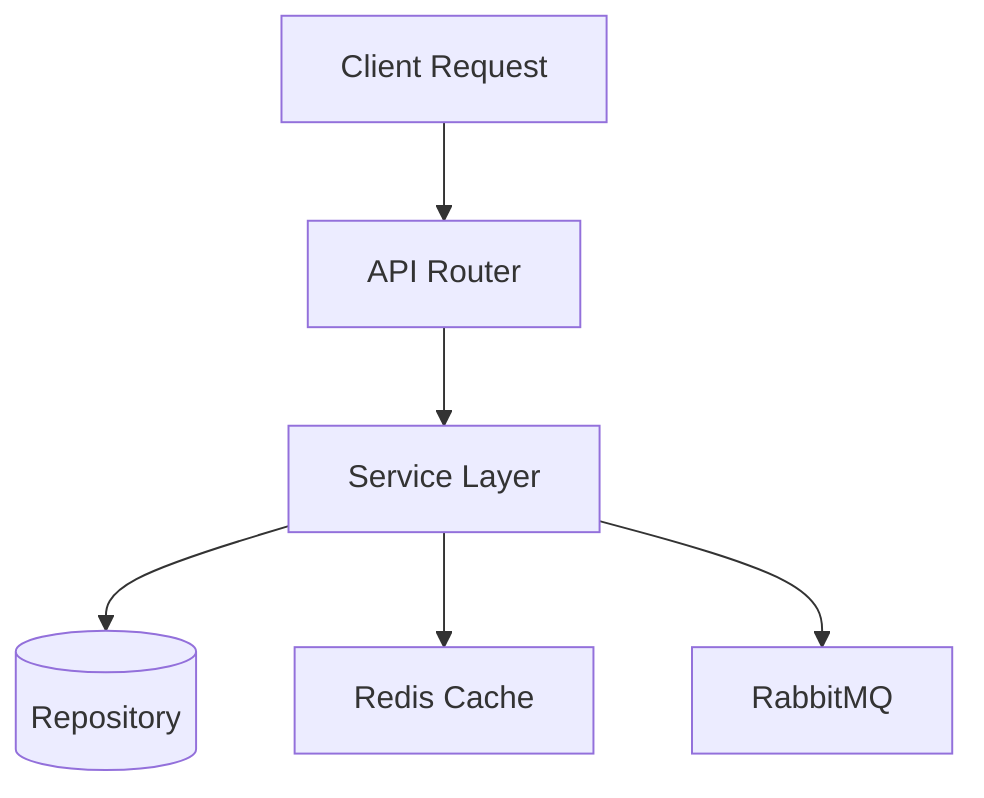
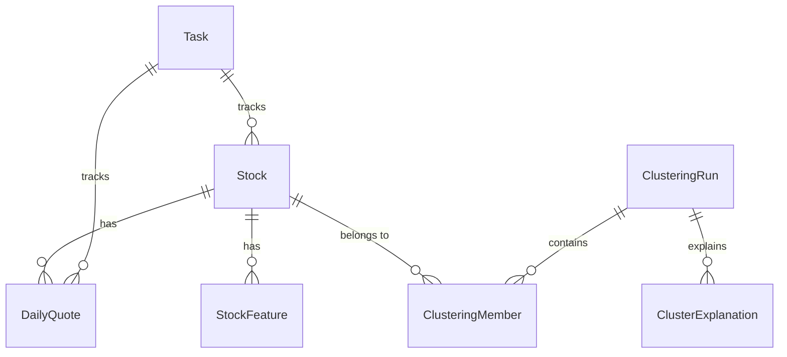
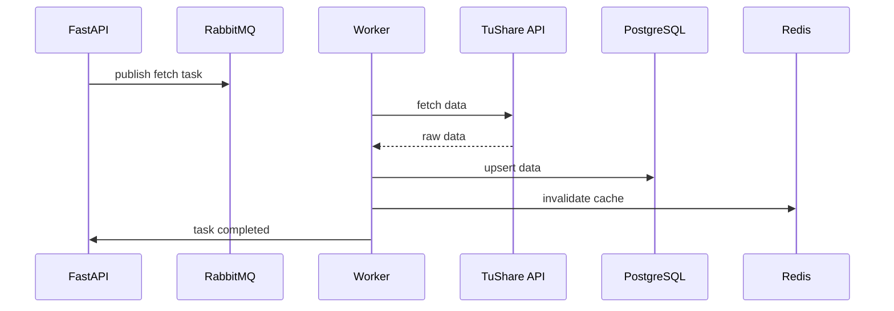
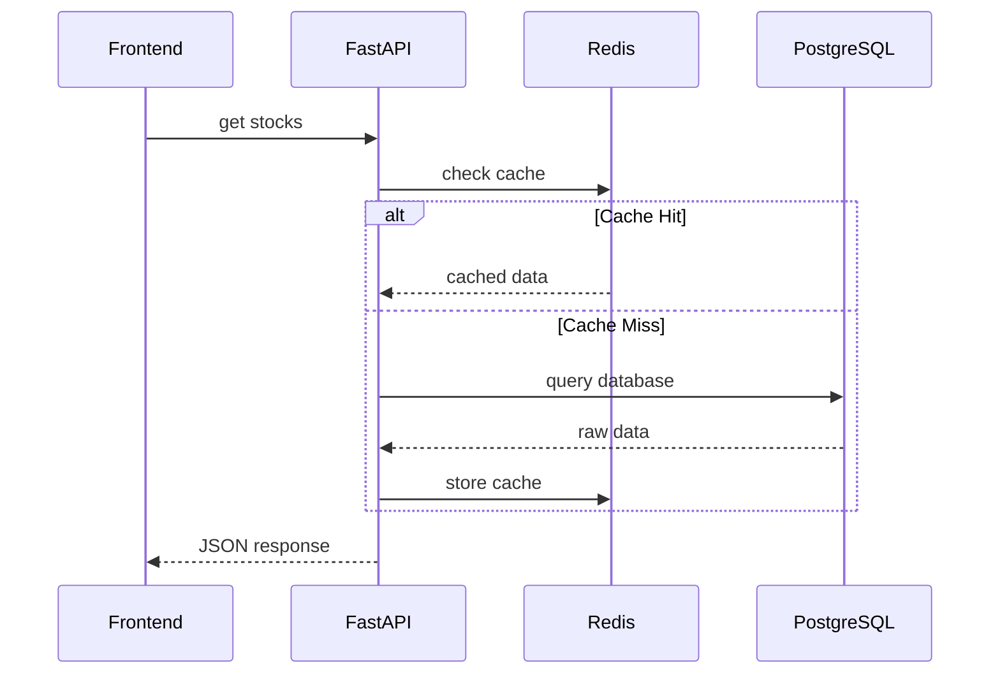
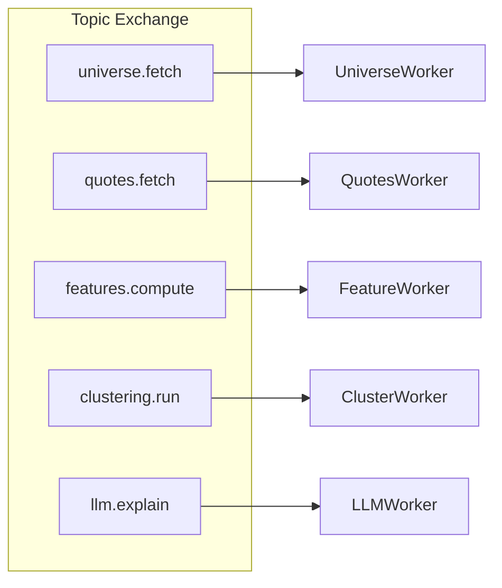
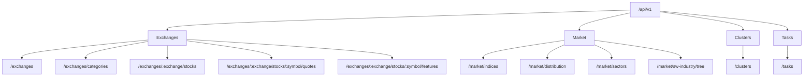
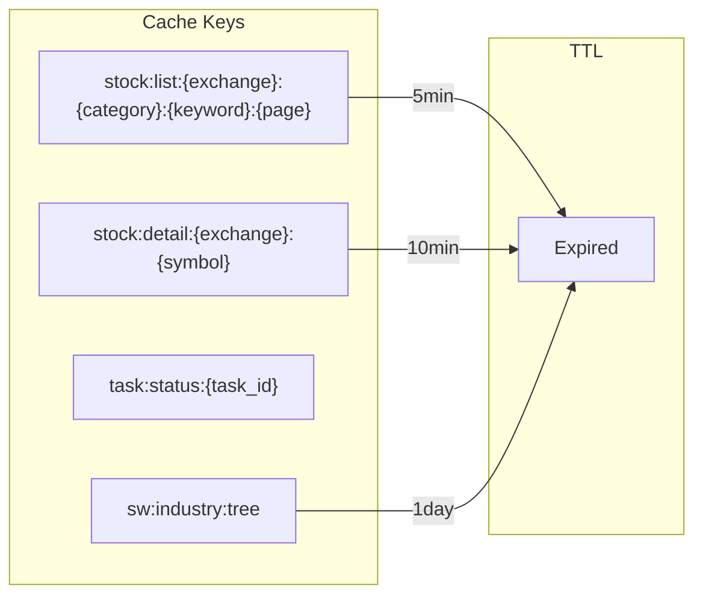

# Backend Architecture

## 1. System Overview

stock-bot 是一个A股市场数据采集、存储和查询分析的后端服务，采用 FastAPI 异步框架构建，集成 PostgreSQL、Redis、RabbitMQ 实现数据存储、缓存和异步任务处理。

## 2. Component Architecture

### 2.1 API Layer

- **Router**: FastAPI 路由层，负责请求校验和路由分发
- **Service**: 业务逻辑层，编排缓存、数据库和消息队列
- **Repository**: 数据访问层，封装 SQLAlchemy 异步操作

### 2.2 Data Model

| Model | Purpose |
|-------|---------|
| Stock | 股票基本信息快照 |
| DailyQuote | 日线 OHLCV 数据（按日期分区） |
| StockFeature | 股票特征指标 |
| ClusteringRun | 聚类运行记录 |
| Task | 后台任务状态跟踪 |

## 3. Data Flow

### 3.1 Sync Data Flow (TuShare Ingestion)

### 3.2 Query Data Flow

## 4. Async Task Processing

| Routing Key | Queue | Worker |
|-------------|-------|--------|
| `universe.fetch` | stock_bot.universe.fetch | UniverseWorker |
| `quotes.fetch` | stock_bot.quotes.fetch | QuotesWorker |
| `features.compute` | stock_bot.features.compute | FeatureWorker |
| `clustering.run` | stock_bot.clustering.run | ClusterWorker |
| `llm.explain` | stock_bot.llm.explain | LLMWorker |

## 5. API Structure

## 6. Caching Strategy

- **Read-Through**: 查询时优先读缓存，缓存命中则返回，未命中则查库并回填缓存
- **Write-Through**: 数据更新时同时更新缓存和数据库
- **Fault Tolerance**: Redis 不可用时自动降级，不影响主业务流程

## 7. Tech Stack

| Component | Technology |
|-----------|------------|
| Web Framework | FastAPI (async) |
| Database | PostgreSQL + SQLAlchemy (async) |
| Cache | Redis |
| Message Queue | RabbitMQ |
| ORM Migrations | Alembic |
| Data Source | TuShare API |
| Container | Docker Compose |
